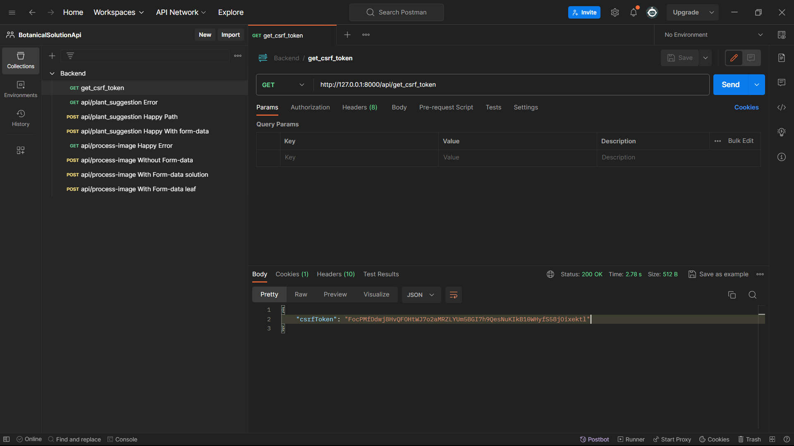
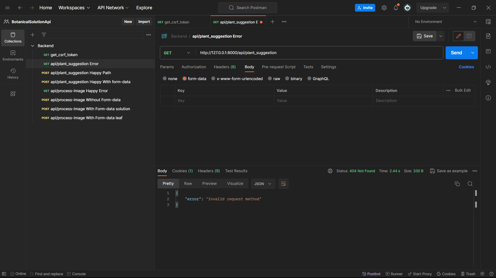
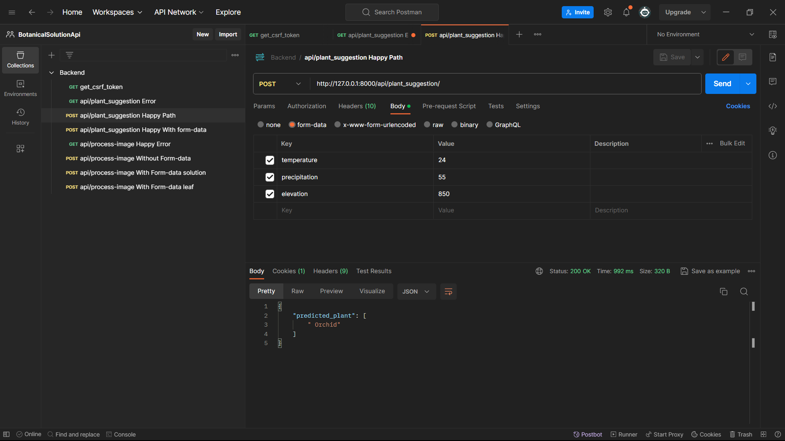
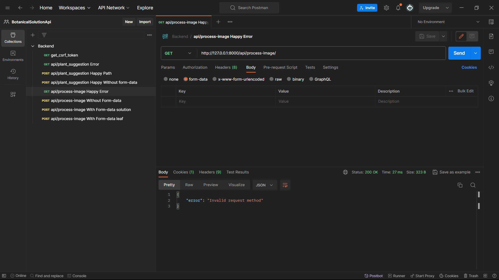
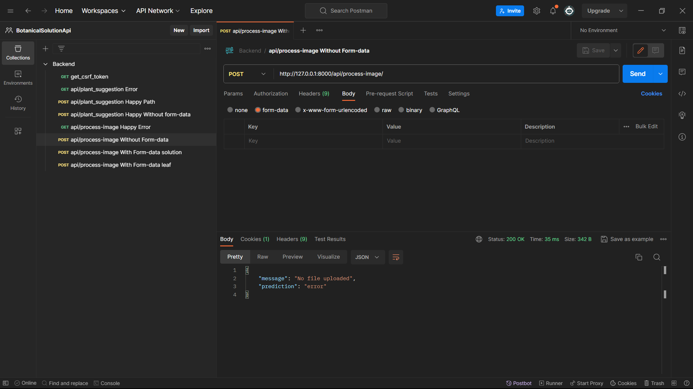
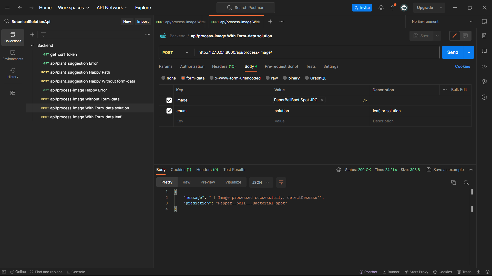
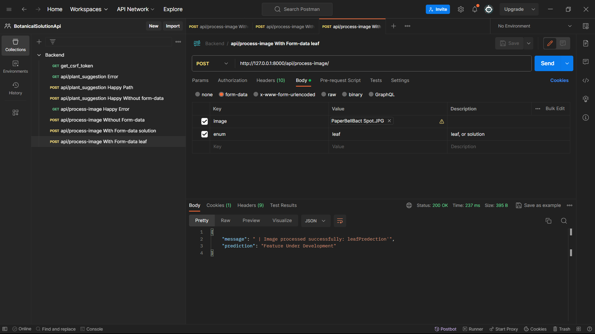

<div align="left">

  <h3 align="left">Botanical Solution Project Backend</h3>

  <p align="left">
    <br />
    <a href="#"><strong>Explore Project </strong></a>
    <br />
  </p>
</div>


<!-- TABLE OF CONTENTS -->
<details>
  <summary>Table of Contents</summary>
  <ol>
    <li>
      <a href="#about-the-project">About The Project</a>
      <ul>
        <li><a href="#built-with">Built With</a></li>
      </ul>
    </li>
    <li>
      <a href="#getting-started">Getting Started</a>
      <ul>
        <li><a href="#prerequisites">Prerequisites</a></li>
        <li><a href="#installation">Installation</a></li>
        <li><a href="#run">Run_Project</a></li>
        <li><a href="#save">Save_Depedency</a></li>
      </ul>
    </li>
    <li><a href="#usage">Usage</a></li>
    <li><a href="#result">Result</a></li>
    <li><a href="#license">License</a></li>
    <li><a href="#contact">Contact</a></li>
    <li><a href="#acknowledgments">Acknowledgments</a></li>
  </ol>
</details>


<!-- ABOUT THE PROJECT -->
## About The Project

[![Product Name Screen Shot][product-screenshot]](https://example.com)

There are many great README templates available on GitHub; however, I didn't find one that really suited my needs so I created this enhanced one. I want to create a README template so amazing that it'll be the last one you ever need -- I think this is it.

Here's why:
* Your time should be focused on creating something amazing. A project that solves a problem and helps others
* You shouldn't be doing the same tasks over and over like creating a README from scratch
* You should implement DRY principles to the rest of your life :smile:

Of course, no one template will serve all projects since your needs may be different. So I'll be adding more in the near future. You may also suggest changes by forking this repo and creating a pull request or opening an issue. Thanks to all the people have contributed to expanding this template!

Use the `BLANK_README.md` to get started.

<p align="right">(<a href="#readme-top">back to top</a>)</p>


### Built With

This section should list any major frameworks/libraries used to bootstrap your project. Leave any add-ons/plugins for the acknowledgements section. Here are a few examples.

* [![Django][Django-logo]][Django-url]
* [![Python][Python-logo]][Python-url]
* [![Tensorflow][Tensorflow-logo]][Python-url]

<p align="right">(<a href="#readme-top">back to top</a>)</p>


<!-- GETTING STARTED -->
## Getting Started

This is an example of how you may give instructions on setting up your project locally.
To get a local copy up and running follow these simple example steps.

### Prerequisites

Install python on your system for this project
* python

### Installation

1. Clone the repo
   ```sh
   git clone https://github.com/your_username_/Project-Name.git
   ```
2. Create a virtual environment 
    * Windows
        ```sh
        python -m venv myenv
        ```
    * Mac/Linux
        ```sh
        python3 -m venv myenv
        ```
3. Activate a virtual environment 
    * Windows
        ```sh
        myenv\Scripts\activate
        ```
    * Mac/Linux
        ```sh
        source myenv/bin/activate
        ```
4. Install Required Modules 
    * Windows
        ```sh
        pip install requirements.txt 
        ```
    * Mac/Linux
        ```sh
        pip3 intall  requirements.txt 
        ```


### Run
1. Activate a virtual environment (Ignore if already activated)
    * Windows
        ```sh
        myenv\Scripts\activate
        ```
    * Mac/Linux
        ```sh
        source myenv/bin/activate
        ```
2. Runserver 
    * Windows
        ```sh
        python manage.py runserver
        ```
    * Mac/Linux
        ```sh
        python3 manage.py runserver 
        ```


### Save
1. Activate a virtual environment (Ignore if already activated)
    * Windows
        ```sh
        myenv\Scripts\activate
        ```
    * Mac/Linux
        ```sh
        source myenv/bin/activate
        ```
2. Runserver 
    * Windows
        ```sh
        pip freeze > requirements.txt 
        ```
    * Mac/Linux
        ```sh
        pip3 freeze > requirements.txt 
        ```


<p align="right">(<a href="#readme-top">back to top</a>)</p>


<!-- USAGE EXAMPLES -->

## Usage

Use this space to show useful examples of how a project can be used. Additional screenshots, code examples and demos work well in this space. You may also link to more resources.

_For more examples, please refer to the [Documentation](https://example.com)_

<p align="right">(<a href="#readme-top">back to top</a>)</p>


<!-- Result -->
## Result
- GET CSRF TOKEN



- GET CSRF TOKEN



- GET CSRF TOKEN



- GET CSRF TOKEN


- GET CSRF TOKEN


- GET CSRF TOKEN


- GET CSRF TOKEN



<p align="right">(<a href="#readme-top">back to top</a>)</p>


<!-- LICENSE -->
## License

Distributed under the MIT License.

<p align="right">(<a href="#readme-top">back to top</a>)</p>


<!-- CONTACT -->
## Contact

Anushka Pradhan -  anushkapradhan3310@gmail.com

Project Link: [https://github.com/anushkapradhan03/BotanicalSolution/](https://github.com/anushkapradhan03/BotanicalSolution/)

<p align="right">(<a href="#readme-top">back to top</a>)</p>


<!-- ACKNOWLEDGMENTS -->
## Acknowledgments

Use this space to list resources you find helpful and would like to give credit to. I've included a few of my favorites to kick things off!

* [Choose an Open Source License](https://choosealicense.com)
* [GitHub Emoji Cheat Sheet](https://www.webpagefx.com/tools/emoji-cheat-sheet)
* [Malven's Flexbox Cheatsheet](https://flexbox.malven.co/)
* [Malven's Grid Cheatsheet](https://grid.malven.co/)
* [Img Shields](https://shields.io)
* [GitHub Pages](https://pages.github.com)
* [Font Awesome](https://fontawesome.com)

<p align="right">(<a href="#readme-top">back to top</a>)</p>


<!-- MARKDOWN LINKS & IMAGES -->
<!-- https://www.markdownguide.org/basic-syntax/#reference-style-links -->
[Django-logo]: https://img.shields.io/badge/Django-20232A?style=for-the-badge&logo=django&logoColor=61DAFB
[Django-url]: https://www.djangoproject.com/


